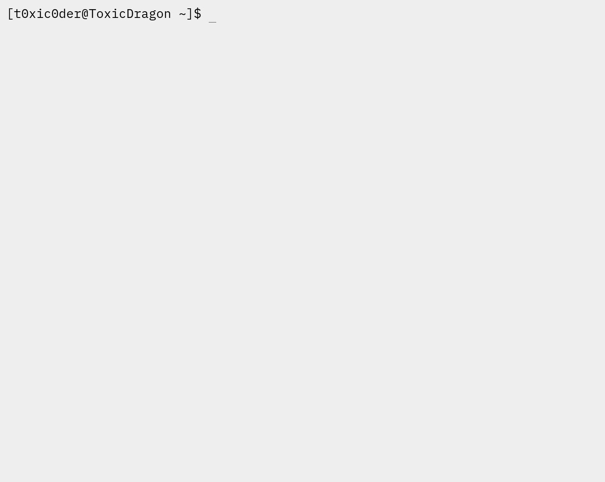

  

<h1 align="center">SuperVisor</h1>
<h3 align="center">Driver Service</h3>

Reference driver endpoint service written in Falcon, Werkzeug, Psutil and Docker

    
    
    
    
    

## Note
This project works as an intuitive remotely accessible system performance monitoring and task management service for 
container station servers and headless Raspberry Pi setups where multiple containers are concurrently running and 
require observation, with secure passcode-protected endpoints so that clients can connect via the [SuperVisor Frontend 
Service](https://github.com/t0xic0der/supervisor-frontend-service/) and manage their devices.

## In action

## Table of contents
1. [Home](https://github.com/t0xic0der/supervisor-driver-service/wiki)
2. [Installation](https://github.com/t0xic0der/supervisor-driver-service/wiki/Installation)
3. [Obtain releases](https://github.com/t0xic0der/supervisor-driver-service/releases)
4. [SuperVisor Frontend Service](https://github.com/t0xic0der/supervisor-frontend-service)

## Contribute
You may request for the addition of new features in the 
[issues](https://github.com/t0xic0der/supervisor-driver-service/issues) page but as the project is singlehandedly 
maintained - it might take time to develop on them. Please consider forking the repository and contributing to its 
development.
